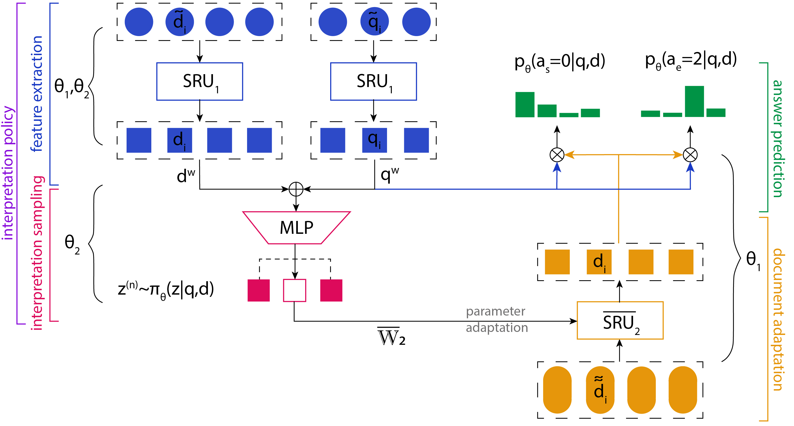

## Graduate Researcher 

<b>Latent Question Interpretation Through Parameter Adaptation</b>

<a href="https://github.com/parshakova/APIP">[Code]</a>

Most artificial neural network models for question-answering rely on complex attention mechanisms.
These techniques demonstrate high performance on existing datasets, however, they are limited in their ability to capture natural language variability, and to generate diverse relevant answers. 
To address this limitation, we propose a model that learns multiple interpretations of a given question. 
This diversity is ensured by our "interpretation policy" module which automatically adapts the parameters of a question answering model with respect to a discrete latent variable. This variable follows the distribution of interpretations learned by the interpretation policy through a semi-supervised variational inference framework.

## Undergraduate Researcher 

<b>Ratchair: Furniture that Learns to Move Itself</b>

 

<iframe width="560" height="315" src="https://www.youtube.com/embed/bbBSVTTapp0" frameborder="0" allow="autoplay; encrypted-media" allowfullscreen></iframe>

<iframe width="560" height="315" src="https://www.youtube.com/embed/_Cn_ajBpr3A" frameborder="0" allow="autoplay; encrypted-media" allowfullscreen></iframe>

 

RatChair a strategy for displacing big objects by attaching relatively small vibration sources. After learning how several random bursts of vibration affect its pose, an optimization algorithm discovers the optimal sequence of vibration patterns required to (slowly but surely) move the object to a specified position.

 

 

<b>UMorph: Self-Change Tracker to Reflect Yourself to the Future and Past</b>

 

<iframe width="560" height="315" src="https://www.youtube.com/embed/fpCcpROzxiE" frameborder="0" allow="autoplay; encrypted-media" allowfullscreen></iframe>
 
Taking photos has become not only a daily but also an
automatic activity. But how do we use all these
pictures? Storage and retrieval are certainly not as well
developed as capturing. Storage systems organize
photos in the temporal dimension, for example, the
Facebook service “Year in Review” or in visual diaries,
but typically do not support a systematic comparison.
  
That was the inspiration for this demonstration,
employing automatically taken photographs and
arranging them so that one could easily go back in time
to reflect oneself to the future and past. This is useful
for tracking well-being and body changes using time
physicalization with a natural interface, as well as an
unobtrusive way for systematic capturing of facial
images over time.

 

 

<b>Luna, Pocket Universe</b>

<iframe width="560" height="315" src="https://www.youtube.com/embed/ySlNFAfA5Kg" frameborder="0" allow="autoplay; encrypted-media" allowfullscreen></iframe>

 

Each pixel of 8x8 dot matrix lives by rules of Conway’s game of life, so-called cellular automaton.
In Conway’s model different patterns are like species, they are developed in response to evolution.
Therefore Luna simulates biological system. So it is real universes with organisms that have own
evolution. Device is called Luna, because this universe is going to be with wearer just as Moon with
Earth, reminding user that he is not alone having alive satellite nearby.
  
Luna is a world of living organisms. To provoke Big Bang user needs to shake sphere and new
world will be born in random manner. Big Bang is accompanied by explosion animation. Device has tilt
ball switch to sense shake.
  
Creator also can exhale her spirit into Luna to make self-sustaining universe. In this case blowing
is recognized my microphone amplifier and one pattern among previously prepared never-dying
patterns will be used. Breathing is accompanied by animation with expanding circles.
Luna is a form of everyday jewelry with unlimited amount of species and lives.

 

 

<b>Roll the Eyeball</b>

<iframe width="382" height="315" src="https://www.youtube.com/embed/2GEP5hpyq-4" frameborder="0" allow="autoplay; encrypted-media" allowfullscreen></iframe>

 

The  device  is  called  “Eyeball”,  it  extension  of  your  natural  eye,  since  literally  it  replaces  one  of  your  eyes  with  itself.
  
The  idea  is  in  letting  yourself  explore  secret  places  which  cannot  be  entered  with  entire  body.  Additional  feature  of  the  Eyeball  is  that  it  movesby  rolling,  so  the  world  it  streams  is  rolling  as  well,  which  gives  rich  disorienting  and  mismatching  effect,  so  in  order  to  understand  streamed  data  user  has  to  compensatemismatching  informationby  thinking  and  other  senses.  Which  is  a  nice  exercise  for  your  brains.
  
The  game  is  called  “Perception”.  User  has  to  observe  a  hidden  place  and  find  a  secret  message.  Which  is  “Hate  is  love”,  this  is  because  word  “hate”  written  on  wall  but  in  reflection  it  turns  to  “love”,  which  is  exactly  what  happens  when  you  look  on  things  under  new  angles,  or  their  reflectionsetc.  This  game  basically  is  saying,  that  if  you  change  the  way  you  look  at  things,  the  things  you  look  at  change.
  
“Roll  the  Eyeball”  is composed of several  parts:  Eyeball,  device  to  control  locomotion  of  ball  placedin  one  of  user’s  hands  (smartphone  with  Android  app  running  on  it),  device  which  shows  streamed  video  fixed  in  front  of  one  of  user’s  eyes  like  a  pirate  band  (smartphone  with  Android  app  running  on  it  behind  biconvex  lens),  and  secret  place  itself,  which  is  a  1x0.8x1.5m  box.
